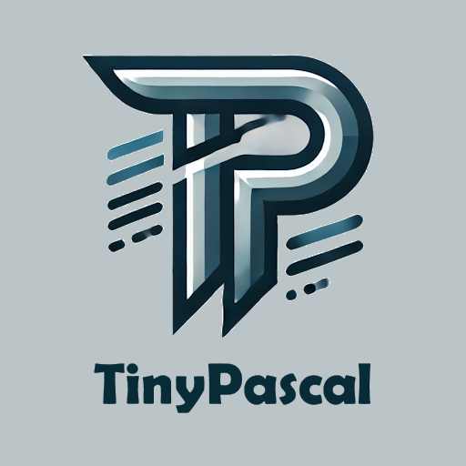

  
[](https://discord.gg/tPWjMwK)
[](https://bsky.app/profile/tinybiggames.com)

> 🚧 **This repository is currently under construction.**
>
> TinyPascal is actively being developed and rapidly evolving. Some features mentioned in this documentation may not yet be fully implemented, and both APIs and internal structure are subject to change as we continue to improve and expand the library.
>
> Your contributions, feedback, and issue reports are highly valued and will help shape TinyPascal into the ultimate Pascal development platform!
    
# TinyPascal
  
**TinyPascal** is a lightweight, embeddable Pascal virtual machine designed for rapid language development, educational use, and embedded scripting. Built in Delphi with a clean modular architecture, TinyPascal uses a modern, case-sensitive variant of Pascal with UTF-8 strings and strong type safety.

TinyPascal features a stack-based virtual machine that executes bytecode generated from Pascal source code. This VM-based approach enables rapid development of language features, reliable execution, and easy embedding in host applications without the complexity of native code generation.

Inspired by the philosophy of simplicity and modularity, TinyPascal is designed to be small, fast, and highly extensible. Perfect for educational projects, embedded scripting, rapid prototyping, and language research.

## ✅ Key Features

- **Virtual Machine Execution**  
  Stack-based VM with type-safe value operations and comprehensive error handling.

- **Bytecode Generation**  
  Compiles Pascal source to efficient bytecode with full disassembly support for debugging.

- **Rapid Development**  
  VM architecture enables quick addition of new language features without low-level complexity.

- **Modern Pascal Syntax**  
  Clean, case-sensitive Pascal with strong type safety and Unicode support.

- **UTF-8 by Design**  
  All strings are UTF-8 internally with seamless integration for text processing.

- **Educational Focus**  
  Perfect for learning compiler construction, language design, and virtual machine concepts.

- **Embeddable Runtime**  
  Self-contained VM with no external dependencies, ideal for embedding in applications.

## 🔧 Type System

TinyPascal supports a clean, modern type system:

- `Int` → signed 64-bit integer
- `UInt` → unsigned 64-bit integer  
- `Float` → IEEE 754 double precision
- `String` → UTF-8 encoded string with automatic memory management
- `PString` → null-terminated `PUTF8Char` for C interop
- `Boolean` → true/false values

## 🧱 VM Architecture

TinyPascal uses a sophisticated multi-layer architecture:

**Frontend (Source → AST)**
- `TinyPascal.Lexer` — Unicode-aware lexical analysis
- `TinyPascal.Parser` — Recursive descent parser with AST generation
- `TinyPascal.AST` — Abstract syntax tree nodes and visitor pattern

**Backend (AST → Execution)**
- `TinyPascal.Value` — Type-safe runtime value system  
- `TinyPascal.Bytecode` — Instruction set and program structure
- `TinyPascal.BytecodeGen` — AST to bytecode compiler
- `TinyPascal.VM` — Stack-based virtual machine execution engine

**Pipeline:** `Source Code → Lexer → Parser → AST → BytecodeGen → VM → Output`

## 🎯 Perfect For

- **🎓 Education** — Learn compiler design and virtual machines
- **🔬 Research** — Experiment with language features rapidly
- **📝 Scripting** — Embed Pascal scripting in applications  
- **🚀 Prototyping** — Quick language concept validation
- **🎮 Game Logic** — Safe, sandboxed game scripting
- **📊 Data Processing** — Mathematical computations with clean syntax

## 📜 Example

```pascal
program ArithmeticDemo;
var 
  x: Int;
  y: Int;
  result: Int;
begin
  x := 10;
  y := 5;
  result := x + y * 2;  // Correct precedence: 10 + (5 * 2) = 20
  WriteLn('Result: ', IntToStr(result));
end.
```

**VM Output:**
```
Result: 20
```

**Generated Bytecode:**
```
LOAD_CONST 10    → Stack: [10]
STORE_VAR x      → x = 10
LOAD_CONST 5     → Stack: [5]  
STORE_VAR y      → y = 5
LOAD_VAR x       → Stack: [10]
LOAD_VAR y       → Stack: [10, 5]
LOAD_CONST 2     → Stack: [10, 5, 2]
MUL              → Stack: [10, 10]    // 5 * 2
ADD              → Stack: [20]        // 10 + 10
STORE_VAR result → result = 20
```

## 🚀 Language Features

TinyPascal provides a complete Pascal subset designed for education, embedded scripting, and rapid development:

- Variable declarations with strong type safety
- Assignment statements and expressions
- Arithmetic expressions with proper operator precedence
- Conditional statements (`if...then...else`)
- Comparison and logical operators (`>`, `<`, `=`, `<>`, `>=`, `<=`, `and`, `or`, `not`)
- Loop constructs (`while`, `for`)
- User-defined procedures and functions
- Built-in functions (`WriteLn`, `IntToStr`, `StrToInt`, etc.)
- Arrays and records
- String and numeric literals
- Boolean expressions and structured programming constructs

## 💬 Support & Resources

- 🐞 **Report Issues:** [GitHub Issue Tracker](https://github.com/tinyBigGAMES/TinyPascal/issues)  
- 💬 **Join the Community:** [Forum](https://github.com/tinyBigGAMES/TinyPascal/discussions) | [Discord](https://discord.gg/tPWjMwK)  
- 📚 **Learn Delphi:** [Learn Delphi](https://learndelphi.org)  

## 🤝 Contributing

We welcome contributions to **TinyPascal**! 🚀  

### 💡 Ways to Contribute:
- 🐛 **Report Bugs** – Help improve stability and reliability
- ✨ **Suggest Features** – Share ideas for new language features  
- 🔧 **Submit Pull Requests** – Add features or fix issues
- 📖 **Improve Documentation** – Help others learn and use TinyPascal
- 🎓 **Create Examples** – Showcase TinyPascal capabilities

### 🏆 Contributors

<a href="https://github.com/tinyBigGAMES/TinyPascal/graphs/contributors">
  
</a>

## 📜 License

**TinyPascal** is distributed under the **BSD-3-Clause License**, allowing redistribution and modification in both source and binary forms. 
See the [LICENSE](https://github.com/tinyBigGAMES/TinyPascal?tab=BSD-3-Clause-1-ov-file#BSD-3-Clause-1-ov-file) for details.

## 💖 Support & Sponsorship

Your support keeps **TinyPascal** evolving! If you find this library useful, please consider [sponsoring the project](https://github.com/sponsors/tinyBigGAMES). Every contribution helps drive future enhancements and innovations.

### Other ways to support:
- ⭐ **Star the repo** – Show your appreciation  
- 📢 **Share with your network** – Spread the word
- 🐛 **Report bugs** – Help improve stability
- 🔧 **Submit fixes** – Contribute code improvements
- 💡 **Suggest features** – Help shape the language's future
- 🎓 **Create tutorials** – Help others learn TinyPascal

🚀 Every contribution makes a difference – thank you for being part of the journey!  
  
---

**TinyPascal** — Modern Pascal ⚡, Virtual Machine 🤖, Rapid Development 🚀

<p align="center">
  
</p>
<h5 align="center">Made with ❤️ in Delphi</h5>