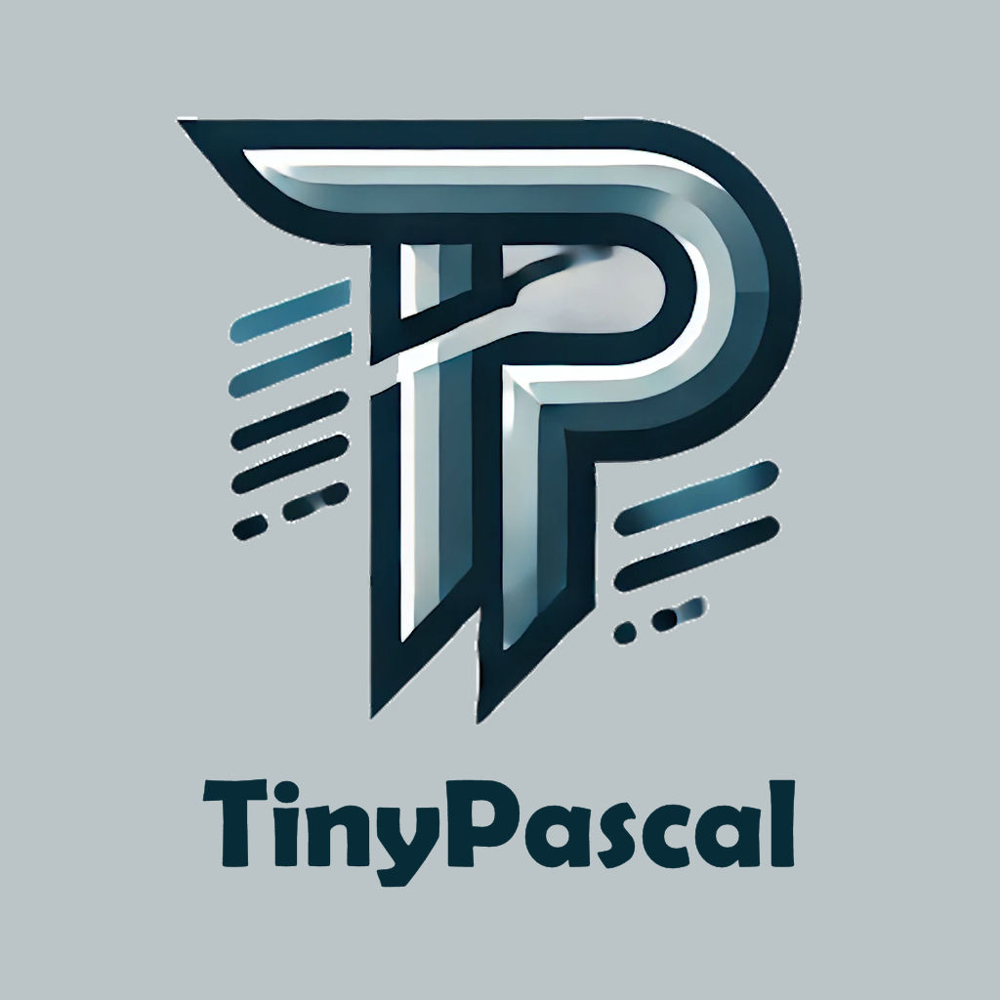

        
  

# TinyPascal
###  Overview
TinyPascal is a lightweight compiler system designed for rapid prototyping and collaboration, especially useful when working with users or clients who may not have a full Delphi installation. Developed in Delphi and based on the Free Pascal Compiler (FPC), TinyPascal offers a range of features in a compact package.

#### Key Features
- **Compiler-as-a-Service (CaaS)**: Allows runtime control of compiler functions, including dynamic code compilation and execution.
- **GenAI Support**: Includes capabilities for integrating Generative AI functionalities.
- **Local Database**: Supports efficient local data storage and retrieval.
- **Basic GUI Framework**: Provides tools for creating simple graphical user interfaces.
- **Speech Capabilities**: Offers basic speech recognition and synthesis features.
- **Game Development Library**: Includes GameLib for foundational game development support.

#### Practical Applications
TinyPascal is particularly useful in environments where Delphi is not installed or where disk space is limited. It has been successfully used to test GenAI code with remote users on AMD-based machines, facilitating quicker development cycles.

#### Advantages
- **Compact Size**: Consists of just `tpc.exe`, `tpl.dll` and a `lib` folder, totaling less than 20MB on your filesystem.
- **Dynamic Compilation**: Supports real-time compilation within applications, useful for scenarios like hot-reloading in game development.
- **Self-Contained Projects**: Configurations are managed through project directives in the source code, eliminating the need for external configuration files.
- **Efficient Prototyping**: Enables quick testing and feedback on target machines with minimal setup.

#### Example Use Case: Game Development

In game development, TinyPascal can be used to implement a hot-reload system:

1. The main application monitors changes to the `game.pas` file.
2. When changes are detected, it unloads the current `game.dll`.
3. TinyPascal compiles the updated source code.
4. If compilation is successful, the new `game.dll` is loaded.
5. The application calls updated routines (startup, shutdown, update, render).

This process is managed by a `THotReload` record, ensuring proper handling of shared resources like the render window.

#### Ongoing Development

TinyPascal continues to evolve, with plans to add more features and libraries to enhance its capabilities for various development needs.

TinyPascal aims to provide a practical solution for developers seeking a lightweight yet capable tool for prototyping, testing, and collaborative development.

### 🌟 Support This Project

If you find this project beneficial, please consider:
- 🌟  Starring the repository  

- 💖 [Sponsoring](https://github.com/sponsors/tinyBigGAMES)
- 📢 Promoting it

Your support is invaluable and highly appreciated.

###  Installation  
- [Download](https://github.com/tinyBigGAMES/TinyPascal/releases) a TinyPascal release, unzip to a desired location.
- Acquire a GGUF model. All vetted models compatible with TinyPascal GenAI can be downloaded from our <a href="https://huggingface.co/tinybiggames/tinypascal" target="_blank">Hugging Face</a> account.
- The library utilizes Vulkan for enhanced performance on supported GPUs. You can perform inference solely on the GPU or distribute the workload between the CPU and GPU to accommodate scenarios with limited VRAM. Ensure the model size does not exceed the available system resources, considering the requisite memory.
- Consult the `installdir\examples` directory for demonstrations of using **TinyPascal**.
- Include the following DLLs in your project distribution: `tpl.dll`.
- This project is developed using RAD Studio 12.1, on Windows 11, powered by an Intel Core i5-12400F at 2500 MHz with 6 cores (12 logical), equipped with 36GB RAM and an NVIDIA RTX 3060 GPU with 12GB VRAM.

###  Examples  

###  Media

###  Support
Our development motto: 
- We will not release products that are buggy, incomplete, adding new features over not fixing underlying issues.
- We will strive to fix issues found with our products in a timely manner.
- We will maintain an attitude of quality over quantity for our products.
- We will establish a great rapport with users/customers, with communication, transparency and respect, always encouraging feedback to help shape the direction of our products.
- We will be decent, fair, remain humble and committed to the craft.

###  Links
- <a href="https://github.com/tinyBigGAMES/TinyPascal/issues" target="_blank">Issues</a>
- <a href="https://github.com/tinyBigGAMES/TinyPascal/discussions" target="_blank">Discussions</a>
- <a href="https://www.facebook.com/groups/tinypascal" target="_blank">Facebook Group</a>
- <a href="https://discord.gg/tPWjMwK" target="_blank">Discord</a>
- <a href="https://youtube.com/tinyBigGAMES" target="_blank">YouTube</a>
- <a href="https://twitter.com/tinyBigGAMES" target="_blank">X (Twitter)</a>
- <a href="https://tinybiggames.com/" target="_blank">tinyBigGAMES</a>

###  License

###  Contributors

