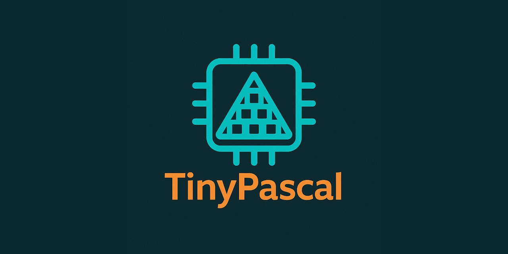

  
[](https://discord.gg/tPWjMwK)
[](https://bsky.app/profile/tinybiggames.com)

> 🚧 **This repository is currently under construction.**
>
> TinyPascal is actively being developed and rapidly evolving. Some features mentioned in this documentation may not yet be fully implemented, and both APIs and internal structure are subject to change as we continue to improve and expand the library.
>
> Your contributions, feedback, and issue reports are highly valued and will help shape TinyPascal into the ultimate 2D game framework for Delphi!
    
# TinyPascal
  
**TinyPascal** is a lightweight, embeddable Pascal compiler designed to compile Pascal source code directly into Win64 PE format in memory, with immediate execution support. It is built in Delphi, follows a modular architecture, and uses a case-sensitive, Unicode-aware variant of Pascal with UTF-8 strings and clean interop with the Windows API and C ABI.

TinyPascal generates x64 machine code without external dependencies, making it ideal for embedding and runtime code generation. It supports writing to memory and will also support .exe, .dll, and .lib output using the same backend.  

Inspired by the design philosophy of TinyCC, TinyPascal is written in Delphi and designed to be small, fast, and modular. It generates x64 machine code directly, with no external dependencies, making it ideal for embedding in other applications or for use in runtime code generation scenarios.

## ✅ Key Features

- **Memory-first Compilation**  
  Compiles Pascal source directly to memory as a valid Win64 PE executable.

- **Direct Execution**  
  Supports executing compiled code in memory without writing to disk.

- **Delphi-Compatible Core**  
  Uses a modern, case-sensitive Pascal syntax with strong compatibility for Delphi features.

- **Unicode by Design**  
  All strings are UTF-8 internally, with runtime UTF-8 → UTF-16 conversion for Windows API compatibility.

- **C ABI Interop**  
  Clean interoperation with C libraries via well-defined basic types.

- **Self-contained Runtime**  
  Built-in x64 codegen and PE generation with no external toolchain required.

## 🔧 Type System

TinyPascal supports the following core types:

- `Int` → signed 64-bit integer
- `UInt` → unsigned 64-bit integer
- `Float` → IEEE 754 double
- `String` → UTF-8 encoded, ref-counted string
- `PString` → null-terminated `PUTF8Char` for C interop

## 🧱 Modular Architecture

TinyPascal is built using a clean modular design. Units follow a consistent naming convention:

- `TinyPascal.Lexer` — Lexical analyzer
- `TinyPascal.Parser` — Syntax parsing and AST generation
- `TinyPascal.CodeGen` — x64 code generation
- `TinyPascal.PE` — Win64 PE format emitter
- `TinyPascal.Runtime` — Core runtime helpers (e.g., UTF-8 to UTF-16 conversion)
- `TinyPascal.Compiler` — Entry point and orchestration

## 📜 Example

```pascal
program HelloWorld;
begin
  WriteLn('Hello, World! 🚀');
end.
```  
  

## 💬 Support & Resources

- 🐞 **Report Issues:** [GitHub Issue Tracker](https://github.com/tinyBigGAMES/TinyPascal/issues)  
- 💬 **Join the Community:** [Forum](https://github.com/tinyBigGAMES/TinyPascal/discussions) | [Discord](https://discord.gg/tPWjMwK)  
- 📚 **Learn Delphi:** [Learn Delphi](https://learndelphi.org)  

## 🤝 Contributing

We welcome contributions to **TinyPascal**! 🚀  

### 💡 Ways to Contribute:
- 🐛 **Report Bugs** – Help improve `TinyPascal` by submitting issues.  
- ✨ **Suggest Features** – Share ideas to enhance its functionality.  
- 🔧 **Submit Pull Requests** – Improve the codebase and add features.  

### 🏆 Contributors

<a href="https://github.com/tinyBigGAMES/TinyPascal/graphs/contributors">
  
</a>

## 📜 License

**TinyPascal** is distributed under the **BSD-3-Clause License**, allowing redistribution and modification in both source and binary forms. 
See the [LICENSE](https://github.com/tinyBigGAMES/TinyPascal?tab=BSD-3-Clause-1-ov-file#BSD-3-Clause-1-ov-file) for details.

## 💖 Support & Sponsorship

Your support keeps **TinyPascal** evolving! If you find this library useful, please consider [sponsoring the project](https://github.com/sponsors/tinyBigGAMES). Every contribution helps drive future enhancements and innovations.

### Other ways to support:
- ⭐ **Star the repo** – Show your appreciation.  
- 📢 **Share with your network** – Spread the word.  
- 🐛 **Report bugs** – Help improve `TinyPascal`.  
- 🔧 **Submit fixes** – Contribute by fixing issues.  
- 💡 **Suggest features** – Help shape its future.  

🚀 Every contribution makes a difference – thank you for being part of the journey!  
  
---

**TinyPascal** — Pascal reborn for systems ⚙️, memory 🧠, and modern interop 🔗.

<p align="center">
  
</p>
<h5 align="center">Made with ❤️ in Delphi</h5>